# Finz Ledger Bridge 技术设计（Proposal）

> 状态：待用户审核  
> 日期：2026-07-29  
> 目标：完成 Finz Accounting Data Engineering Challenge  
> 原则：未经用户批准，本设计不进入正式实现阶段

## 1. 文档目的

本文定义 Finz Ledger Bridge 的产品范围、会计口径、系统架构、数据模型、
API、QuickBooks Online（QBO）集成、AI 分类策略、抗幻觉机制、对账逻辑、
安全要求、测试策略、部署方案与交付顺序。

这不是一个“让大模型猜科目”的 Demo。系统的完成标准是：

1. 同一份原始数据可重复处理且结果稳定；
2. 重复记录不会重复进入账簿；
3. 非损益项目不会污染 P&L；
4. 每一笔分类都可解释、可审核、可纠正；
5. QBO 同步可安全重试，不会重复记账；
6. 内部 P&L 与 QBO Cash-basis P&L 按账户和净利润逐项对平；
7. 任意 P&L 数字可以追溯至原始文件、原始行、分类决策和 QBO 对象。

## 2. 当前状态

### 2.1 已完成

- 已阅读并分析挑战 PDF 和 Excel 数据集；
- 已建立并清理 US QBO Plus Sandbox；
- Sandbox 公司名称已设置为 `BrightFix Home Services LLC`；
- 会计基础已设置为 Cash；
- 财年起始月已设置为 January；
- 已启用 Account Numbers；
- 已导入题目规定的 21 个 QBO 账户；
- 21 个账户初始余额为 0；
- 已创建 Intuit Developer App：`Finz Ledger Bridge`；
- 已设置 Development Client ID、Client Secret 和 Redirect URI；
- 已完成 QBO OAuth；
- 已成功调用 QBO CompanyInfo，验证连接公司为 BrightFix；
- 已创建 FastAPI 最小服务和 OAuth 自动化测试；
- 当前测试数量：6；
- MongoDB Atlas URI 已配置，但当前 VPN 对 Atlas 27017 TLS 连接存在干扰。

### 2.2 今晚明确暂停

- 不继续配置 Docker；
- 不继续处理 MongoDB Atlas TLS；
- 不执行需要用户网页登录、确认或授权的操作；
- 不继续实现业务功能代码；
- 不对 QBO 写入交易。

### 2.3 明日需人工参与的事项

- 决定本地 MongoDB 使用 Docker，或为 Atlas 配置 VPN Split Tunneling；
- 审核并批准本文；
- 若本文获批，生成正式实施计划；
- 重新完成一次 QBO OAuth，使 Token 持久化到数据库。

## 3. 默认假设

如用户未提出修改，实施阶段采用以下假设：

1. 系统为单公司、单用户挑战演示，不实现完整多租户；
2. 前端使用 React + TypeScript；
3. 后端使用 Python 3.12 + FastAPI；
4. 主数据库使用 MongoDB；
5. 本地开发优先使用 Docker MongoDB；
6. 最终部署可切换 MongoDB Atlas；
7. AI Provider 抽象为接口，默认使用 OpenAI API；
8. Codex作为开发工具；运行时模型通过 API 调用；
9. 即使没有运行时 AI，规则系统仍能正确处理挑战数据；
10. AI 只能提出受约束的分类建议，不能决定金额、日期、去重、P&L 数学或最终同步；
11. 所有 QBO 写入必须经过审核或达到明确的安全自动批准条件；
12. 不实现销售税、库存、A/R、A/P、折旧或工资负债；
13. 只处理 USD；
14. 使用银行交易日期作为 Cash-basis Recognition Date；
15. QBO Sandbox 是唯一外部账簿目标；
16. Demo 的主要评价标准是正确性、可解释性、幂等性和对账，而不是复杂基础设施。

## 4. 范围

### 4.1 In Scope

- CSV/XLSX 上传；
- 可配置列映射；
- 原始记录不可变保存；
- 标准化交易；
- 数据质量校验；
- 精确和保守型重复检测；
- 双边内部转账匹配；
- 确定性会计规则；
- 历史人工修正规则；
- AI 结构化分类建议；
- 人工审核、批量批准和修改；
- 月度及三个月内部 P&L；
- P&L 明细下钻；
- QBO OAuth、Token 刷新和账户验证；
- QBO 幂等同步和安全重试；
- 拉取 QBO Cash-basis P&L；
- 逐账户、逐期间及净利润对账；
- 审计日志；
- README、架构说明、AI 使用说明和录屏流程。

### 4.2 Out of Scope

- 生产级多租户；
- 真实银行连接；
- 支付处理；
- Payroll API；
- Sales Tax；
- 库存；
- A/R 与 A/P；
- 发票与账单工作流；
- 折旧；
- 银行对账单 Reconciliation；
- 移动端；
- 复杂权限系统；
- 完整 SOC 2 / PCI 合规；
- 模型训练或微调；
- 向量数据库；
- Agent 自主入账；
- 自动修改 QBO Chart of Accounts。

## 5. 成功标准

### 5.1 数据正确性

- 200 条原始数据全部保存；
- 识别出 195 个唯一 Bank Transaction ID；
- 识别出 5 条重叠文件重复记录；
- 去重后每月 65 笔，共 195 笔；
- 识别 6 组内部转账，即 12 条银行记录；
- 识别 1 笔 Owner Contribution；
- 识别 3 笔 Customer Refund；
- 识别 1 笔 Fixed Asset Purchase；
- 没有记录被静默丢弃。

### 5.2 会计正确性

- 转账不进入 P&L；
- Owner Contribution 不进入 P&L；
- Owner Distribution 不进入 P&L；
- Fixed Asset Purchase 不进入 P&L；
- Refund 进入 contra-revenue；
- Materials 和 Subcontractors 进入 COGS；
- Operating Expenses 进入对应 6000 系列科目；
- Gross Profit 和 Net Profit 使用确定性代码计算；
- 账户分类只能使用指定的 21 个账户。

### 5.3 QBO 正确性

- QBO CompanyInfo 必须匹配 BrightFix；
- 21 个账户全部通过 API 验证；
- 同一交易重复同步不会创建第二个 QBO 对象；
- 每笔同步保存 QBO ID；
- Token 可刷新；
- 失败同步可重试；
- 内部 P&L 与 QBO P&L 每个账户差额为 0；
- 每月和三个月 Net Profit 差额为 0。

### 5.4 UX 正确性

- 用户可以上传和映射列；
- 用户可以查看异常和重复；
- 用户可以查看分类解释与置信度；
- 用户可以修改和批准分类；
- 用户可以从 P&L 下钻到交易；
- 用户可以发起 QBO 同步；
- 用户可以查看同步状态；
- 用户可以查看对账差异及解释。

## 6. 候选方案

### 6.1 方案 A：LLM-first

所有交易直接发送给模型分类。

优点：

- 初期代码少；
- 对新描述有一定泛化能力；
- Demo 观感偏“AI”。

缺点：

- 结果非确定性；
- 可能发明不存在的科目；
- 可能把 Owner Contribution 识别为收入；
- 可能把 Transfer 识别为收入或费用；
- 无法可靠做幂等、去重和计算；
- 审计性弱；
- 很难解释重复运行差异。

结论：不采用。

### 6.2 方案 B：纯规则

所有交易通过 Regex、关键词和商户表分类。

优点：

- 确定性强；
- 可测试；
- 可解释；
- 足以高质量处理本挑战数据。

缺点：

- 对新银行描述泛化较弱；
- 无法充分展示 AI-native 思路；
- 规则维护成本随场景增长。

结论：作为系统核心，但不是唯一分类层。

### 6.3 方案 C：规则优先、AI 辅助、人工控制

处理优先级：

1. Schema 和数据质量验证；
2. Bank Transaction ID 精确去重；
3. Transfer 双边匹配；
4. 会计硬规则；
5. 历史人工批准规则；
6. 商户模式规则；
7. AI 结构化建议；
8. 风险评分；
9. 人工审核；
10. 批准后同步。

优点：

- 兼顾正确性和泛化；
- AI 失败时仍可运行；
- 可审计；
- 可持续学习人工纠正；
- 最符合真实会计产品设计。

缺点：

- 架构比纯规则复杂；
- 需要决策优先级和冲突处理；
- 必须建设评估体系。

结论：采用方案 C。

## 7. 总体架构

```mermaid
flowchart LR
    A["CSV / XLSX"] --> B["Upload Service"]
    B --> C["Column Mapping"]
    C --> D["Immutable Raw Records"]
    D --> E["Normalization"]
    E --> F["Validation & Quarantine"]
    F --> G["Deduplication"]
    G --> H["Transfer Matching"]
    H --> I["Rule Engine"]
    I --> J["Correction Memory"]
    J --> K["AI Classifier"]
    K --> L["Risk & Confidence"]
    L --> M["Review Queue"]
    M --> N["Approved Ledger View"]
    N --> O["Internal P&L"]
    N --> P["QBO Outbox"]
    P --> Q["QBO API"]
    Q --> R["QBO P&L"]
    O --> S["Reconciliation"]
    R --> S
    S --> T["Audit & Evidence"]
```



## 8. 技术栈

### 8.1 Frontend

- React；
- TypeScript；
- Vite；
- React Router；
- TanStack Query；
- TanStack Table；
- Zod；
- Tailwind CSS；
- shadcn/ui；
- Recharts（仅用于必要图表）；
- Vitest；
- React Testing Library；
- Playwright。

### 8.2 Backend

- Python 3.12；
- FastAPI；
- Uvicorn；
- Pydantic v2；
- PyMongo AsyncMongoClient；
- HTTPX；
- Cryptography/Fernet；
- Pytest；
- Ruff；
- MyPy 或 Pyright；
- OpenTelemetry 或结构化 JSON logging。

### 8.3 Database

- MongoDB 8；
- 本地：Docker MongoDB；
- 部署：MongoDB Atlas；
- 通过 Repository 接口隔离数据库实现；
- 关键集合使用唯一索引和状态索引。

### 8.4 External Services

- QuickBooks Online Accounting API；
- OpenAI API（如运行时 AI 获批准）；
- 不使用真实银行 API。

## 9. 代码边界

建议目录：

```text
backend/
  app/
    api/
      health.py
      uploads.py
      transactions.py
      classifications.py
      reports.py
      qbo_oauth.py
      qbo_sync.py
      reconciliations.py
    core/
      config.py
      logging.py
      security.py
      errors.py
    domain/
      transactions/
      accounting/
      classification/
      reconciliation/
    services/
      ingestion_service.py
      normalization_service.py
      deduplication_service.py
      transfer_matcher.py
      classification_service.py
      pnl_service.py
      qbo_sync_service.py
      reconciliation_service.py
    integrations/
      quickbooks/
      ai/
    repositories/
    models/
    main.py
  tests/
    unit/
    integration/
    contract/

frontend/
  src/
    api/
    components/
    features/
      uploads/
      transactions/
      review/
      pnl/
      qbo/
      reconciliation/
    pages/
    routes/
```

边界要求：

- `domain` 不依赖 FastAPI、MongoDB 或 QBO；
- `services` 编排领域逻辑；
- `repositories` 定义持久化接口；
- `integrations` 封装外部 API；
- `api` 只做请求解析、权限、调用服务和响应转换；
- 前端不重复实现会计逻辑。

## 10. 数据模型

### 10.1 ingestion_files

```json
{
  "_id": "ObjectId",
  "original_filename": "string",
  "media_type": "text/csv | application/vnd.openxmlformats...",
  "sha256": "string",
  "size_bytes": 12345,
  "status": "uploaded | mapped | processing | completed | failed",
  "mapping_version": 1,
  "row_count": 200,
  "created_at": "datetime",
  "completed_at": "datetime|null",
  "error_summary": []
}
```

唯一索引：

- `sha256` 可用于提示相同文件已上传；
- 不直接拒绝相同文件，以便展示幂等行为；
- 原始行仍由 dedupe key 防止重复入账。

### 10.2 column_mappings

```json
{
  "_id": "ObjectId",
  "name": "BrightFix supplied workbook",
  "source_format": "xlsx",
  "sheet_name": "Raw Bank Transactions",
  "header_row": 4,
  "mapping": {
    "source_file": "Source File",
    "bank_transaction_id": "Bank Transaction ID",
    "transaction_date": "Transaction Date",
    "posted_date": "Posted Date",
    "description": "Description",
    "amount": "Amount (USD)",
    "currency": "Currency",
    "bank_account": "Bank Account"
  },
  "created_at": "datetime"
}
```

### 10.3 raw_records

原始记录不可修改。

```json
{
  "_id": "ObjectId",
  "ingestion_file_id": "ObjectId",
  "source_file_name": "string",
  "source_sheet": "Raw Bank Transactions",
  "source_row_number": 5,
  "raw_values": {},
  "raw_record_sha256": "string",
  "ingested_at": "datetime"
}
```

要求：

- 原始值不被标准化结果覆盖；
- 对原始行计算 hash；
- 错误记录仍保存。

### 10.4 normalized_transactions

```json
{
  "_id": "ObjectId",
  "raw_record_id": "ObjectId",
  "bank_transaction_id": "BF-202604-0001",
  "transaction_date": "2026-04-02",
  "posted_date": "2026-04-02",
  "description_original": "ACH CREDIT ...",
  "description_normalized": "ACH CREDIT BLUEBIRD PROPERTY MANAGEMENT INV 4100",
  "merchant_normalized": "BLUEBIRD PROPERTY MANAGEMENT",
  "amount_minor": 342500,
  "currency": "USD",
  "direction": "inflow",
  "bank_account_number": "1000",
  "exact_dedupe_key": "sha256",
  "semantic_dedupe_key": "sha256",
  "duplicate_status": "unique | canonical | duplicate | possible_duplicate",
  "canonical_transaction_id": "ObjectId|null",
  "transfer_pair_id": "ObjectId|null",
  "processing_status": "ready | quarantined",
  "quality_issues": [],
  "created_at": "datetime"
}
```

金额使用 integer minor units，避免浮点误差：

```text
$3,425.00 → 342500
-$35.00    → -3500
```

### 10.5 transfer_pairs

```json
{
  "_id": "ObjectId",
  "outflow_transaction_id": "ObjectId",
  "inflow_transaction_id": "ObjectId",
  "amount_minor": 500000,
  "date_distance_days": 0,
  "match_method": "reference_and_amount",
  "status": "matched | needs_review",
  "created_at": "datetime"
}
```

### 10.6 classification_decisions

每次分类都是追加版本，不覆盖历史。

```json
{
  "_id": "ObjectId",
  "transaction_id": "ObjectId",
  "version": 2,
  "transaction_type": "revenue | cogs | operating_expense | refund | transfer | owner_activity | fixed_asset",
  "counterparty": "string|null",
  "account_number": "6030",
  "source": "hard_rule | learned_rule | merchant_rule | ai | human",
  "confidence": 0.98,
  "risk_level": "low | medium | high",
  "evidence": [],
  "rule_ids": [],
  "model_provider": "openai|null",
  "model_name": "string|null",
  "prompt_version": "string|null",
  "needs_review": false,
  "approval_status": "suggested | approved | rejected | superseded",
  "approved_by": "user|null",
  "approved_at": "datetime|null",
  "created_at": "datetime"
}
```

唯一索引：

- `(transaction_id, version)`。

### 10.7 classification_rules

```json
{
  "_id": "ObjectId",
  "name": "Intuit subscription",
  "priority": 100,
  "conditions": {
    "description_contains": ["QUICKBOOKS"],
    "direction": "outflow"
  },
  "result": {
    "transaction_type": "operating_expense",
    "account_number": "6030",
    "counterparty": "Intuit"
  },
  "source": "human_approved",
  "active": true,
  "created_from_transaction_id": "ObjectId|null",
  "created_at": "datetime"
}
```

### 10.8 qbo_connections

```json
{
  "_id": "ObjectId",
  "provider": "quickbooks",
  "environment": "sandbox",
  "realm_id": "9341457609469713",
  "company_name": "BrightFix Home Services LLC",
  "access_token_encrypted": "binary",
  "refresh_token_encrypted": "binary",
  "access_token_expires_at": "datetime",
  "refresh_token_expires_at": "datetime",
  "scopes": ["com.intuit.quickbooks.accounting"],
  "status": "connected | refresh_required | disconnected | error",
  "last_verified_at": "datetime",
  "created_at": "datetime",
  "updated_at": "datetime"
}
```

要求：

- Token 不以明文存储；
- API 响应和日志不输出 Token；
- Refresh Token 轮换后原子更新；
- `realm_id` 唯一索引。

### 10.9 qbo_accounts

```json
{
  "_id": "ObjectId",
  "realm_id": "string",
  "qbo_account_id": "string",
  "account_number": "4000",
  "name": "Repair Service Revenue",
  "account_type": "Income",
  "account_subtype": "ServiceFeeIncome",
  "active": true,
  "required_by_challenge": true,
  "last_synced_at": "datetime"
}
```

唯一索引：

- `(realm_id, qbo_account_id)`；
- `(realm_id, account_number)`。

### 10.10 qbo_sync_outbox

```json
{
  "_id": "ObjectId",
  "transaction_id": "ObjectId",
  "classification_decision_id": "ObjectId",
  "idempotency_key": "string",
  "qbo_entity_type": "Deposit | Purchase | Transfer",
  "request_payload_redacted": {},
  "status": "pending | processing | succeeded | retryable_failed | permanent_failed",
  "attempt_count": 0,
  "next_attempt_at": "datetime|null",
  "qbo_entity_id": "string|null",
  "qbo_sync_token": "string|null",
  "last_error_code": "string|null",
  "last_error_message": "string|null",
  "created_at": "datetime",
  "updated_at": "datetime"
}
```

唯一索引：

- `idempotency_key`；
- `transaction_id`。

### 10.11 reconciliation_runs

```json
{
  "_id": "ObjectId",
  "period_start": "2026-04-01",
  "period_end": "2026-04-30",
  "accounting_method": "Cash",
  "status": "running | reconciled | differences | failed",
  "internal_report_snapshot": {},
  "qbo_report_snapshot": {},
  "lines": [
    {
      "account_number": "4000",
      "account_name": "Repair Service Revenue",
      "internal_amount_minor": 100000,
      "qbo_amount_minor": 100000,
      "difference_minor": 0,
      "status": "matched",
      "explanation": null
    }
  ],
  "net_profit_difference_minor": 0,
  "created_at": "datetime"
}
```

## 11. 数据导入与标准化

### 11.1 上传流程

1. 计算文件 SHA-256；
2. 检测文件类型；
3. 安全解析，不执行宏；
4. 显示工作表；
5. 自动猜测 Header Row；
6. 用户确认字段映射；
7. 预览前 20 行；
8. 执行导入；
9. 保存 Raw Record；
10. 生成 Normalized Transaction；
11. 产生数据质量报告。

### 11.2 标准化规则

- 日期统一为 ISO date；
- 金额统一为 integer cents；
- 正数为 inflow；
- 负数为 outflow；
- Currency 只允许 USD；
- 银行账户映射为 1000/1010；
- 描述去除首尾空格；
- 多空格压缩；
- 保留 Original Description；
- 不删除可能有意义的数字和 Reference；
- Bank Transaction ID 保持字符串。

### 11.3 Quarantine

以下记录进入隔离区：

- 缺少 Transaction Date；
- 缺少 Amount；
- 无法解析金额；
- Currency 非 USD；
- 未知银行账户；
- Bank Transaction ID 缺失；
- 日期超出允许范围且用户未确认；
- 同一 ID 对应不一致的金额或日期。

隔离记录不会同步，但不会丢失。

## 12. 去重设计

### 12.1 Level 1：Bank Transaction ID

如果 `Bank Transaction ID` 相同：

- 原始字段一致：选择第一条为 Canonical，其余为 Duplicate；
- 原始字段不一致：标记 Conflict，必须人工审核。

本数据集 5 条重叠文件重复项由此识别。

### 12.2 Level 2：Exact Fingerprint

用于没有稳定 Bank ID 的未来文件：

```text
bank account
+ transaction date
+ amount
+ normalized description
+ currency
```

### 12.3 Level 3：Possible Duplicate

金额相同、账户相同、日期接近、描述相似时，只标记 possible duplicate，
不得自动删除。

### 12.4 幂等导入

同一文件重复上传时：

- 可创建新的 ingestion run 供审计；
- raw_record hash 指向已有 canonical transaction；
- 不创建新的可同步交易；
- UI 显示“0 new / N duplicate”。

## 13. Transfer Matching

匹配条件：

1. 两条记录分属 1000 和 1010；
2. 金额绝对值相同，符号相反；
3. 日期相同或相差不超过 2 天；
4. 描述包含 TRANSFER；
5. Reference 后缀相同则提高置信度。

匹配结果：

- 两条记录保留；
- 共同关联一个 transfer_pair；
- 分类为 transfer；
- 从 P&L 排除；
- QBO 中优先创建 Transfer Entity；
- 不分别创建收入和费用。

## 14. 会计分类

### 14.1 决策优先级

```text
Duplicate exclusion
> Transfer pair
> Hard accounting rule
> Human-approved learned rule
> Merchant rule
> AI proposal
> Manual review
```

高优先级结果不能被低优先级覆盖。

### 14.2 硬规则

- `OWNER CAPITAL` → 3000 Owner's Equity；
- `OWNER DRAW` / `OWNER DISTRIBUTION` → 3000 Owner's Equity；
- `REFUND TO` → 4100 Customer Refunds；
- `COMMERCIAL TOOL PACKAGE` → 1500 Tools & Equipment；
- 已匹配 Transfer Pair → Transfer；
- Positive Maintenance Plan → 4020；
- Positive Installation → 4010；
- Positive Repair/Service → 4000；
- Home Depot / Lowe's / Ferguson / SupplyHouse / Grainger 等材料商 → 5000；
- Subcontractor 描述 → 5010；
- ADP Payroll → 6000；
- Rent → 6010；
- Fuel → 6020；
- QuickBooks / Workspace / ServiceTitan → 6030；
- Google Ads / Yelp → 6040；
- Hiscox → 6050；
- Con Edison / Verizon → 6060；
- CPA / Professional → 6070；
- Monthly Service Fee → 6080；
- Staples / Office Supplies → 6090；
- Fleet Auto Care / Repair → 6100。

规则必须数据驱动，不散落在 API 代码中。

### 14.3 风险规则

以下永远要求人工审核，除非被非常明确的硬规则覆盖：

- Owner Activity；
- Fixed Asset；
- Transfer 未能双边匹配；
- Refund；
- 高金额新商户；
- 模型与规则不一致；
- 科目与金额方向不一致；
- 可能重复；
- 未知交易类型。

## 15. AI 分类与抗幻觉

### 15.1 Provider 抽象

```python
class ClassificationProvider(Protocol):
    async def classify(
        self,
        transaction: ClassificationInput,
        allowed_accounts: list[AllowedAccount],
    ) -> ClassificationProposal:
        ...
```

可实现：

- `OpenAIClassificationProvider`；
- `GeminiClassificationProvider`；
- `DisabledClassificationProvider`。

业务逻辑不依赖具体模型厂商。

### 15.2 模型输入

只发送必要字段：

- description；
- amount direction；
- absolute amount；
- transaction date；
- bank account；
- allowed account list；
- relevant accounting rules；
- approved merchant examples。

不发送：

- QBO Token；
- Client Secret；
- Mongo URI；
- 用户登录凭据；
- 无关原始文件。

### 15.3 结构化输出

```json
{
  "transaction_type": "operating_expense",
  "counterparty": "Intuit",
  "account_number": "6030",
  "confidence": 0.97,
  "needs_review": false,
  "evidence": [
    "Description contains QUICKBOOKS ONLINE",
    "6030 is the allowed software subscription account"
  ]
}
```

约束：

- transaction_type 为枚举；
- account_number 必须来自 21 个白名单；
- confidence 为 0–1；
- evidence 必须引用输入证据；
- 允许 `unknown`；
- 模型不得生成金额、日期或 Bank ID。

### 15.4 后置验证

模型输出必须通过：

- JSON Schema；
- Account whitelist；
- Account type 与 transaction type 一致性；
- Amount direction sanity check；
- Hard rule conflict check；
- Duplicate/Transfer exclusion；
- Risk threshold。

### 15.5 置信度不是模型自报分数

最终分数由系统组合：

```text
hard rule match
+ approved merchant match
+ model confidence
+ consistency with amount direction
+ consistency with account type
+ model/rule agreement
- new merchant penalty
- high-risk category penalty
- ambiguity penalty
```

### 15.6 自动批准策略

挑战阶段推荐保守：

- Hard rule + low risk：可自动批准；
- Learned rule + exact match：可自动批准；
- AI-only：必须人工审核；
- Transfer/Owner/Refund/Asset：人工审核；
- Possible duplicate：人工审核。

这样可以证明 AI 有价值，同时不会把财务正确性交给概率模型。

## 16. 内部 P&L

### 16.1 数据来源

仅使用：

- canonical unique transaction；
- approved classification；
- processing_status = ready；
- P&L account；
- transaction date 位于报告期间。

排除：

- duplicate；
- transfer；
- owner activity；
- fixed asset；
- quarantined；
- unapproved。

### 16.2 报表结构

```text
Revenue
  4000 Repair Service Revenue
  4010 Installation Revenue
  4020 Maintenance Plan Revenue
  4100 Customer Refunds
Total Revenue

Cost of Goods Sold
  5000 Materials & Supplies
  5010 Subcontractor Costs
Total COGS

Gross Profit

Operating Expenses
  6000–6100
Total Operating Expenses

Net Profit
```

### 16.3 符号约定

数据库保存银行方向金额：

- inflow 正；
- outflow 负。

P&L 展示：

- Revenue 正；
- Refund 负；
- COGS 正数展示为费用；
- Operating Expense 正数展示为费用；
- Net Profit = Revenue - COGS - OpEx。

为避免符号混乱，P&L Aggregator 使用 Account Behavior 转换，不在 UI 临时取绝对值。

### 16.4 下钻

每条 P&L Line 返回：

- Account Number；
- Account Name；
- Total；
- Transaction Count；
- Transaction IDs；
- API 支持分页查看明细。

## 17. QBO OAuth 与 Token

### 17.1 已完成流程

```text
/connect
→ Intuit authorize
→ /callback
→ code exchange
→ CompanyInfo
```

### 17.2 持久化

Callback 成功后：

1. 验证 state；
2. 换 Token；
3. 调用 CompanyInfo；
4. 检查公司名称；
5. 加密 Token；
6. upsert qbo_connections；
7. 记录 expiry；
8. 返回前端成功页面。

### 17.3 Token 刷新

QBO API 调用前：

- Access Token 距过期少于 5 分钟则刷新；
- 使用数据库原子锁避免并发重复刷新；
- 刷新成功后同时更新 Access 和 Refresh Token；
- 刷新失败将连接状态设为 refresh_required；
- 不自动无限重试认证错误。

## 18. QBO Account Verification

固定白名单：

```text
1000, 1010, 1500, 3000,
4000, 4010, 4020, 4100,
5000, 5010,
6000, 6010, 6020, 6030, 6040,
6050, 6060, 6070, 6080, 6090, 6100
```

连接后查询 Active Accounts：

```sql
SELECT * FROM Account WHERE Active = true
```

验证：

- 21 个编号全部存在；
- Account Number 唯一；
- Name 符合预期；
- Account Type 符合预期；
- Detail Type 差异记录但不一定阻断；
- 银行账户余额初始为 0；
- 系统默认账户不进入白名单。

如果 Account Type 错误：阻断同步。  
如果 Detail Type 是最接近映射：记录 Warning。  
如果存在额外 QBO 系统账户：忽略。

## 19. QBO 记账对象映射

推荐映射：

### 19.1 收入和退款

使用 `Deposit`：

- DepositToAccountRef = 1000；
- Line.AccountRef = 4000/4010/4020/4100；
- Refund 使用负 Line Amount 或 QBO 支持的等效形式；
- 需用 Sandbox Contract Test 验证 P&L 符号。

### 19.2 支出

使用 `Purchase`，PaymentType = Cash：

- AccountRef = 1000；
- Expense Line AccountRef = COGS/Expense/Asset/Equity；
- Amount 使用正数，QBO 对 Bank Account 产生减少。

### 19.3 转账

使用 `Transfer`：

- FromAccountRef = 1000；
- ToAccountRef = 1010；
- 每一组内部转账只创建一个 QBO Transfer；
- 两条银行记录共同指向同一 QBO Transfer ID。

### 19.4 Owner Contribution

使用 `Deposit`：

- DepositToAccountRef = 1000；
- Line.AccountRef = 3000。

### 19.5 Owner Distribution

使用 `Purchase`：

- AccountRef = 1000；
- Expense Line AccountRef = 3000。

### 19.6 Fixed Asset

使用 `Purchase`：

- AccountRef = 1000；
- Expense Line AccountRef = 1500。

它影响资产负债表，不进入 P&L。

## 20. QBO 幂等性

### 20.1 内部 Idempotency Key

```text
qbo:{realm_id}:{canonical_transaction_id}:{classification_version}
```

Transfer 使用：

```text
qbo:{realm_id}:transfer:{transfer_pair_id}
```

### 20.2 写入前

1. 检查 outbox 唯一索引；
2. 检查是否已有 succeeded；
3. 检查 QBO ID；
4. 必要时通过 DocNumber/PrivateNote 查询 QBO；
5. 仅创建一次。

### 20.3 写入后

- 保存 QBO ID；
- 保存 SyncToken；
- 保存成功时间；
- 回读对象；
- 验证 AccountRef 和 Amount；
- 标记 succeeded。

### 20.4 重试

可重试：

- timeout；
- 429；
- 5xx；
- 临时网络错误。

不可自动重试：

- 400 validation；
- 401 refresh 失败；
- 403 permission；
- missing account；
- accounting invariant failure。

## 21. 对账

### 21.1 报告期间

- 2026-04-01 至 2026-04-30；
- 2026-05-01 至 2026-05-31；
- 2026-06-01 至 2026-06-30；
- 2026-04-01 至 2026-06-30。

### 21.2 QBO 参数

- Report：ProfitAndLoss；
- Accounting Method：Cash；
- Start Date / End Date；
- USD；
- Account-level detail。

### 21.3 标准化

QBO Report JSON 为嵌套 Rows。Parser 必须：

- 递归读取 Sections；
- 识别 Account ID 和 Name；
- 映射 Account Number；
- 解析字符串金额为 cents；
- 空值视为 0；
- 不按显示顺序假设账户；
- 保存原始 QBO 报告快照。

### 21.4 比较

```text
difference = internal - qbo
```

Tolerance：

- USD cents 精确匹配；
- 容差 0 cents；
- 不用浮点 tolerance。

### 21.5 差异诊断

自动生成原因候选：

- missing in QBO；
- duplicate QBO post；
- wrong account；
- wrong period；
- wrong sign；
- excluded internally but posted to QBO；
- posted internally but missing in QBO；
- QBO report method not Cash；
- refund mapped incorrectly；
- transfer posted as income/expense；
- asset/owner activity mapped to P&L。

## 22. API 设计

### 22.1 System

```text
GET  /health
GET  /ready
```

### 22.2 Upload

```text
POST /api/v1/uploads
GET  /api/v1/uploads/{id}
POST /api/v1/uploads/{id}/mapping
POST /api/v1/uploads/{id}/process
GET  /api/v1/uploads/{id}/quality-report
```

### 22.3 Transactions

```text
GET /api/v1/transactions
GET /api/v1/transactions/{id}
GET /api/v1/transactions/{id}/lineage
```

Filters：

- month；
- status；
- duplicate；
- risk；
- account；
- approval；
- search。

### 22.4 Classification

```text
POST /api/v1/classifications/run
POST /api/v1/transactions/{id}/approve
POST /api/v1/transactions/{id}/correct
POST /api/v1/classifications/bulk-approve
```

### 22.5 P&L

```text
GET /api/v1/reports/pnl?start_date=&end_date=
GET /api/v1/reports/pnl/accounts/{account_number}/transactions
```

### 22.6 QBO

```text
GET  /api/v1/integrations/qbo/connect
GET  /api/v1/integrations/qbo/callback
GET  /api/v1/integrations/qbo/status
POST /api/v1/integrations/qbo/verify-accounts
POST /api/v1/integrations/qbo/sync
GET  /api/v1/integrations/qbo/sync-runs/{id}
POST /api/v1/integrations/qbo/sync-items/{id}/retry
```

### 22.7 Reconciliation

```text
POST /api/v1/reconciliations
GET  /api/v1/reconciliations/{id}
GET  /api/v1/reconciliations/{id}/differences
```

## 23. 前端 UX

### 23.1 页面

1. Dashboard；
2. Upload & Mapping；
3. Processing Summary；
4. Transaction Review；
5. Internal P&L；
6. QBO Connection & Account Verification；
7. Sync Monitor；
8. Reconciliation；
9. Audit / Lineage。

### 23.2 核心演示路径

```text
Upload workbook
→ confirm mapping
→ see 200 raw / 195 unique / 5 duplicates
→ review special transactions
→ approve classifications
→ view monthly P&L
→ connect QBO
→ verify 21 accounts
→ sync
→ run QBO reconciliation
→ show zero differences
```

### 23.3 Review Table

列：

- Date；
- Description；
- Amount；
- Bank Account；
- Transaction Type；
- Counterparty；
- QBO Account；
- Decision Source；
- Confidence；
- Risk；
- Explanation；
- Approval Status。

功能：

- 过滤；
- 排序；
- 搜索；
- 批量批准低风险；
- 修改科目；
- 查看原始行；
- 查看重复/Transfer pair。

### 23.4 P&L

- 月份切换；
- 三个月汇总；
- 收入、COGS、毛利、费用、净利润；
- 点击账户查看交易；
- 明确 Cash Basis；
- 显示数据更新时间。

### 23.5 Reconciliation

列：

- Account；
- Internal；
- QBO；
- Difference；
- Status；
- Explanation。

Matched 绿色，Difference 红色，但不只依靠颜色传达状态。

## 24. 安全

### 24.1 Secrets

- `.env` 不提交；
- `.env.example` 不含真实值；
- Client Secret 发生泄露立即 Rotate；
- Token 不写日志；
- Mongo URI 不输出；
- 前端永远看不到 Refresh Token；
- QBO callback code 不持久化。

### 24.2 Token Encryption

推荐：

- Fernet key 从环境变量加载；
- MongoDB 只保存 ciphertext；
- key 不与数据库放在一起；
- 部署时使用平台 Secret Manager；
- key 轮换另列运维任务。

### 24.3 OAuth State

当前内存 Set 仅用于初期验证。正式实现：

- cryptographically random；
- hash 后写 Mongo；
- 10 分钟过期；
- single use；
- callback 原子消费；
- SameSite Cookie 或关联 session。

### 24.4 File Security

- 限制文件大小；
- 只允许 CSV/XLSX；
- 不执行宏；
- 不信任 MIME；
- 限制 Sheet/Row/Column 数量；
- 避免 Formula Injection；
- 原始文件使用随机存储名。

## 25. 错误处理

统一错误格式：

```json
{
  "error": {
    "code": "QBO_ACCOUNT_MISSING",
    "message": "Required QBO account 6030 is missing",
    "retryable": false,
    "correlation_id": "uuid",
    "details": {}
  }
}
```

禁止：

- 返回 stack trace；
- 返回 Token；
- 静默忽略；
- 把所有错误都变成 500；
- 无限重试。

## 26. 日志与审计

每条日志包含：

- timestamp；
- level；
- correlation_id；
- operation；
- entity_id；
- result；
- duration_ms。

审计事件：

- file uploaded；
- mapping confirmed；
- duplicate detected；
- classification proposed；
- classification corrected；
- classification approved；
- QBO connected；
- accounts verified；
- sync attempted；
- sync succeeded/failed；
- reconciliation run；
- report downloaded。

日志中不包含：

- Client Secret；
- Access Token；
- Refresh Token；
- Mongo URI；
- OAuth code；
- 完整银行数据 payload。

## 27. 测试策略

### 27.1 Unit Tests

- 日期解析；
- 金额解析；
- 方向；
- 描述标准化；
- exact dedupe；
- conflict dedupe；
- transfer matching；
- accounting rules；
- classification precedence；
- whitelist validation；
- P&L aggregation；
- sign conventions；
- reconciliation arithmetic；
- idempotency key；
- retry classification。

### 27.2 Golden Dataset

将挑战数据建立为 Golden Fixture：

- 200 raw；
- 195 unique；
- 5 duplicates；
- 6 transfer pairs；
- 1 owner contribution；
- 3 refunds；
- 1 fixed asset；
- 预期每账户/月度总额；
- 预期三个月 P&L。

### 27.3 Integration Tests

- Mongo Repository；
- FastAPI + Mongo；
- OAuth state storage；
- encrypted token round-trip；
- QBO response parser；
- file upload；
- outbox transition。

### 27.4 Contract Tests

对 QBO Sandbox：

- CompanyInfo；
- Account Query；
- Deposit；
- Purchase；
- Transfer；
- P&L Report；
- Token Refresh。

所有写入 Contract Test 使用专用测试前缀并可清理。

### 27.5 End-to-End

- Upload → Review → P&L；
- QBO Connect → Verify Accounts；
- Approve → Sync；
- Reconcile → Zero Difference；
- Re-run Sync → No Duplicate；
- API failure → Safe Retry。

### 27.6 会计不变量

```text
Raw count = processed + quarantined
Unique + duplicate extras = raw count
Transfer pair contains exactly 2 legs
Transfer legs have opposite signs and equal absolute amount
Gross Profit = Revenue - COGS
Net Profit = Gross Profit - Operating Expenses
Every approved P&L transaction has exactly one valid P&L account
Every succeeded sync has one QBO ID
Internal - QBO = reconciliation difference
```

## 28. 部署

### 28.1 本地

- Frontend：5173；
- Backend：8000；
- MongoDB：127.0.0.1:27017；
- QBO Redirect URI：localhost；
- Docker 只用于 MongoDB。

### 28.2 Demo 部署

可选：

- Frontend：Vercel；
- Backend：Render/Railway；
- Database：Atlas；
- Redirect URI 改为 HTTPS；
- CORS 只允许部署前端；
- Secrets 放平台 Secret Store。

### 28.3 VPN 问题

本地 Atlas 27017 被 VPN TLS 链路干扰时：

- 本地使用 Docker MongoDB；
- 部署环境直接连接 Atlas；
- 不伪造 IP；
- 不关闭 Atlas TLS；
- 不使用 `tlsAllowInvalidCertificates=true`；
- 不把 `0.0.0.0/0` 当作 TLS 修复手段。

## 29. 实施阶段

本文批准后，正式实施计划应拆成以下阶段：

### Phase 0：基础与数据库

- Python 3.12 环境统一；
- Docker MongoDB；
- Config；
- Mongo ping；
- Repository；
- Token encryption。

### Phase 1：QBO Foundation

- OAuth state Mongo persistence；
- Token persistence；
- Token refresh；
- CompanyInfo；
- 21 account verification。

### Phase 2：Ingestion

- Upload；
- XLSX/CSV；
- mapping；
- raw records；
- normalization；
- quality report。

### Phase 3：Accounting Core

- dedupe；
- transfer；
- rules；
- classification versioning；
- human corrections。

### Phase 4：Internal P&L

- monthly；
- consolidated；
- drill-down；
- golden totals。

### Phase 5：Frontend

- upload；
- review；
- P&L；
- QBO；
- sync；
- reconciliation。

### Phase 6：QBO Sync

- account ID map；
- Deposit/Purchase/Transfer；
- outbox；
- retry；
- idempotency；
- read-back。

### Phase 7：Reconciliation

- QBO report parser；
- comparison；
- mismatch diagnostics；
- zero-difference acceptance.

### Phase 8：AI

- Provider interface；
- structured output；
- post-validation；
- evaluation；
- AI usage note。

AI 放在会计核心之后，避免 AI 阻塞正确性。

### Phase 9：Polish & Delivery

- README；
- setup；
- architecture；
- assumptions；
- limitations；
- screenshots；
- screen-recording script；
- final test；
- demo reset procedure。

## 30. Skill 策略

不建议现在下载“万能会计 Agent”。建议创建三个项目内 Skill：

### 30.1 finz-accounting-classifier

包含：

- 21 个账户；
- Cash-basis 规则；
- 分类优先级；
- 方向检查；
- 高风险类别；
- Golden examples；
- 禁止模型生成金额或科目。

### 30.2 qbo-safe-sync

包含：

- OAuth；
- Token refresh；
- Account validation；
- Entity mapping；
- Idempotency；
- Retry；
- Read-back；
- 禁止重复入账。

### 30.3 pnl-reconciliation

包含：

- Internal P&L；
- QBO Report Parser；
- Account Mapping；
- Sign normalization；
- Period rules；
- Difference diagnostics；
- Zero-difference gate。

创建 Skill 前仍需单独设计和验证，不能用 Skill 替代代码测试。

## 31. 关键决策记录

### ADR-001：选择规则优先 Hybrid Classification

原因：财务正确性优先于模型表现。

### ADR-002：金额存 integer cents

原因：避免浮点误差和对账舍入问题。

### ADR-003：Raw Record 不可变

原因：审计、追溯和重新处理。

### ADR-004：分类追加版本

原因：保留 AI 建议、人工修改和批准历史。

### ADR-005：QBO 写入使用 Outbox

原因：支持幂等、重试和状态追踪。

### ADR-006：本地 Docker Mongo，部署 Atlas

原因：本地 VPN 阻断 Atlas TLS；不降低 TLS 安全性。

### ADR-007：AI 不参与数学与同步

原因：减少幻觉和不可复现行为。

## 32. 审核问题

用户审核时请重点确认：

1. 是否同意 React + FastAPI + MongoDB；
2. 是否同意本地 Docker Mongo、部署 Atlas；
3. 是否同意规则优先、AI 辅助；
4. 是否同意 AI-only 分类必须人工审核；
5. 是否同意先完成会计核心，再做 AI；
6. 是否同意 Deposit/Purchase/Transfer 的 QBO 映射；
7. 是否同意挑战阶段只做单公司、单用户；
8. 是否需要今晚/明日优先交付某个可见页面；
9. 是否需要创建三个项目 Skill；
10. 是否批准进入正式 Implementation Plan。

## 33. 实施门禁

只有在用户明确回复批准后，才进行：

1. 调用 `superpowers:writing-plans`；
2. 生成逐文件、逐测试、逐命令实施计划；
3. 再开始代码实现。

在用户批准前，不继续开发功能代码。
